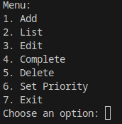
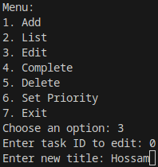
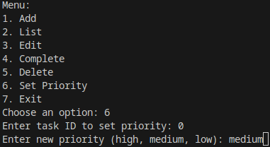

# TMA - TM109

- Omar Hossam Haider
- 23513600

## PART 1 (Pseudocode):

<span style="color:#DB8A74">
// Define a Task structure to hold task details
</span>

- class Task:

  - title: string

  - description: string
  - dueDate: date
  - priority: enum (high, medium, low)
  - completed: boolean

<span style="color:#DB8A74">
// Create an empty list to store tasks
</span>

tasks = []

<span style="color:#DB8A74">
// Function to add a new task to the list
</span>

- function addTask(title, description, dueDate, priority):
  - task = create Task with provided details
  - add task to tasks list
  - print "Task added successfully"

<span style="color:#DB8A74">
// Function to list all tasks
</span>

- function listTasks():
  - if tasks is empty:
    - print "No tasks found"
  - else:
    - for each task in tasks:
    - print task details in a readable format

<span style="color:#DB8A74">
// Function to replace an existing task with new details
</span>

- function editTask(id, title, description, dueDate, priority):
  - if id is invalid:
    - print "Invalid task ID"
  - else:
    - find task in tasks list with matching id
    - update task details with provided values
    - print "Task edited successfully"

<span style="color:#DB8A74">
// Function to mark a task as completed
</span>

- function markCompleted(id):
  - if id is invalid:
    - print "Invalid task ID"
  - else:
    - find task in tasks list with matching id
    - set task completed status to true
    - print "Task marked as completed"

<span style="color:#DB8A74">
// Function to delete a task from the list
</span>

- function deleteTask(id):
  - if id is invalid:
    - print "Invalid task ID"
  - else:
    - find task in tasks list with matching id
    - remove task from tasks list
    - print "Task deleted successfully"

<span style="color:#DB8A74">
// Function to set the priority of a task
</span>

- function setPriority(id, priority):
  - if id is invalid:
    - print "Invalid task ID"
  - else:
    - find task in tasks list with matching id
    - update task priority with provided value
    - print "Task priority updated successfully"

<span style="color:#DB8A74">
// Main function to run the To-Do List application
</span>

- function main():
  - display welcome message
  - loop until user chooses to exit:
  - display menu options
  - read user choice
  - handle user choice: - add a task - list all tasks - edit a task - mark a task as completed - delete a task - set task priority - exit the application
  - display goodbye message

## PART 2 (CSharp Code):

---

### prerequisites:

- Visual Studio Version 17.0.0
- .NET 8
- ConsoleTables 2.6.1 (NuGet Package)
  ```
  dotnet add package ConsoleTables --version 2.6.1
  ```

---

### 1. Define the Task class:

```csharp
/// Priority Values
public enum Priority
{
    /// High priority
    High,
    /// Medium priority
    Medium,
    /// Low priority
    Low
}

/// Task Item Model
public class TaskItem
{
    /// Task Title
    public string Title { get; set; }
    /// Task Description
    public string Description { get; set; }
    /// Task Due Date
    public DateTime DueDate { get; set; }
    /// Task Priority
    public Priority Priority { get; set; }
    /// Task Completion Status
    public bool Completed { get; set; }

    /// Task Item Constructor
    public TaskItem(string title, string description, DateTime dueDate, Priority priority)
    {
        Title = title;
        Description = description;
        DueDate = dueDate;
        Priority = priority;
        Completed = false;
    }
}

```

### 2. Define The Controller And Methods:

```csharp
using System;
using ConsoleTables;
using System.Collections.Generic;
using System.Linq;

public static class TodoController
{
    /// Represents the priority of a task.
    private static List<TaskItem> tasks = new List<TaskItem>();

    /// Adds a new task to the task list.
    public static void AddTask(string title, string description, DateTime dueDate, Priority priority)
    {
        /// Create And Add New Task.
        tasks.Add(new TaskItem(title, description, dueDate, priority));
        /// Print Success Message.
        Console.WriteLine("Task added successfully.");
    }

    /// Lists all tasks in the task list.
    public static void ListTasks()
    {
        /// Check If Task List Is Empty.
        if (tasks.Count == 0)
        {
            /// Print No Task Found Message.
            Console.WriteLine("No tasks found.");
            return;
        }

        /// Create Table.
        var table = new ConsoleTable("ID", "Title", "Description", "Due Date", "Priority", "Completed");
        /// Loop Through Tasks And Add To Table.
        foreach (var task in tasks.OrderBy(t => t.Priority))
        {
            /// Add Row To Table.
            table.AddRow(tasks.IndexOf(task), task.Title, task.Description, task.DueDate.ToString("yyyy-MM-dd"), task.Priority, task.Completed ? "Yes" : "No");
        }

        /// Print Table.
        Console.WriteLine(table.ToString());
    }

    /// Edits an existing task in the task list.
    public static void EditTask(int id, string title, string description, DateTime dueDate, Priority priority)
    {
        /// Check If Task ID Is Valid.
        if (id < 0 || id >= tasks.Count)
        {
            /// Print Invalid Task ID Message.
            Console.WriteLine("Invalid task ID.");
            return;
        }
        /// Get Task By ID.
        TaskItem task = tasks[id];
        /// Print Editing Task Message.
        Console.WriteLine($"Editing task: {task.Title}");
        /// Update Task Title.
        task.Title = title;
        /// Update Task Description.
        task.Description = description;
        /// Update Task Due Date.
        task.DueDate = dueDate;
        /// Update Task Priority.
        task.Priority = priority;
        Console.WriteLine("Task edited successfully.");
    }

    /// Marks a task as completed.
    public static void CompleteTask(int id)
    {
        /// Check If Task ID Is Valid.
        if (id < 0 || id >= tasks.Count)
        {
            /// Print Invalid Task ID Message.
            Console.WriteLine("Invalid task ID.");
            return;
        }
        /// Mark Task As Completed.
        tasks[id].Completed = true;
        /// Print Task Marked As Completed Message.
        Console.WriteLine("Task marked as completed.");
    }

    /// Deletes a task from the task list.
    public static void DeleteTask(int id)
    {
        /// Check If Task ID Is Valid.
        if (id < 0 || id >= tasks.Count)
        {
            /// Print Invalid Task ID Message.
            Console.WriteLine("Invalid task ID.");
            return;
        }
        /// Remove Task From Task List.
        tasks.RemoveAt(id);
        /// Print Task Deleted Message.
        Console.WriteLine("Task deleted successfully.");
    }

    /// Sets the priority of a task in the task list.
    public static void SetPriority(int id, Priority priority)
    {
        /// Check If Task ID Is Valid.
        if (id < 0 || id >= tasks.Count)
        {
            /// Print Invalid Task ID Message.
            Console.WriteLine("Invalid task ID.");
            return;
        }
        /// Set Task Priority.
        tasks[id].Priority = priority;
        /// Print Priority Set Message.
        Console.WriteLine("Priority set successfully.");
    }

    /// Displays the menu options for managing tasks.
    public static void DisplayMenu()
    {
        /// Print Menu Options.
        Console.WriteLine("Menu:");
        Console.WriteLine("1. Add");
        Console.WriteLine("2. List");
        Console.WriteLine("3. Edit");
        Console.WriteLine("4. Complete");
        Console.WriteLine("5. Delete");
        Console.WriteLine("6. Set Priority");
        Console.WriteLine("7. Exit");
        Console.Write("Choose an option: ");
    }

    /// Runs the todo list application.
    public static void RunTodoList()
    {
        /// Declare Choice Variable.
        string? choice;
        do
        {
            /// Display Menu.
            DisplayMenu();
            /// Get User Choice.
            choice = Console.ReadLine()?.ToLower();
            /// Check User Choice.
            switch (choice)
            {
                /// Add Task.
                case "1":
                case "add":
                    /// Get Task Title.
                    Console.Write("Enter task title: ");
                    string? title = Console.ReadLine();
                    /// Get Task Description.
                    Console.Write("Enter task description: ");
                    string? description = Console.ReadLine();
                    /// Get Task Due Date.
                    Console.Write("Enter due date (YYYY-MM-DD): ");
                    DateTime dueDate;

                    /// Check If Due Date Is Valid.
                    if (!DateTime.TryParse(Console.ReadLine(), out dueDate))
                    {
                        /// Print Invalid Date Format Message.
                        Console.WriteLine("Invalid date format. Task not added.");
                        break;
                    }
                    /// Get Task Priority.
                    Console.Write("Enter priority (high, medium, low): ");
                    string? priorityStr = Console.ReadLine()?.ToLower();
                    if (priorityStr != "high" && priorityStr != "medium" && priorityStr != "low")
                    {
                        /// Print Invalid Priority Message.
                        Console.WriteLine("Invalid priority. Task not added.");
                        break;

                    }
                    /// Parse Priority.
                    Priority priority = (Priority)Enum.Parse(typeof(Priority), priorityStr, true);
                    AddTask(title.ToString(), description.ToString(), dueDate, priority);
                    break;

                /// List Tasks.
                case "2":
                case "list":
                    ListTasks();
                    break;

                /// Edit Task.
                case "3":
                case "edit":
                    /// Get Task ID To Edit.
                    Console.Write("Enter task ID to edit: ");
                    if (!int.TryParse(Console.ReadLine(), out int editId))
                    {
                        /// Print Invalid Task ID Message.
                        Console.WriteLine("Invalid task ID.");
                        break;
                    }
                    /// Get New Task Title.
                    Console.Write("Enter new title: ");
                    string? newTitle = Console.ReadLine();
                    /// Get New Task Description.
                    Console.Write("Enter new description: ");
                    string? newDescription = Console.ReadLine();
                    /// Get New Task Due Date.
                    Console.Write("Enter new due date (YYYY-MM-DD): ");
                    DateTime newDueDate;

                    if (!DateTime.TryParse(Console.ReadLine(), out newDueDate))
                    {
                        /// Print Invalid Date Format Message.
                        Console.WriteLine("Invalid date format. Task not edited.");
                        break;
                    }
                    /// Get New Task Priority.
                    Console.Write("Enter new priority (high, medium, low): ");
                    string? newPriorityStr = Console.ReadLine()?.ToLower();
                    if (newPriorityStr != "high" && newPriorityStr != "medium" && newPriorityStr != "low")
                    {
                        /// Print Invalid Priority Message.
                        Console.WriteLine("Invalid priority. Task not edited.");
                        break;
                    }
                    /// Parse New Priority.
                    Priority newPriority = (Priority)Enum.Parse(typeof(Priority), newPriorityStr, true);
                    EditTask(editId, newTitle.ToString(), newDescription.ToString(), newDueDate, newPriority);
                    break;

                /// Complete Task.
                case "4":
                case "complete":
                    /// Get Task ID To Mark As Completed.
                    Console.Write("Enter task ID to mark as completed: ");
                    if (!int.TryParse(Console.ReadLine(), out int completeId))
                    {
                        /// Print Invalid Task ID Message.
                        Console.WriteLine("Invalid task ID.");
                        break;
                    }
                    CompleteTask(completeId);
                    break;

                /// Delete Task.
                case "5":
                case "delete":
                    /// Get Task ID To Delete.
                    Console.Write("Enter task ID to delete: ");
                    if (!int.TryParse(Console.ReadLine(), out int deleteId))
                    {
                        /// Print Invalid Task ID Message.
                        Console.WriteLine("Invalid task ID.");
                        break;
                    }
                    DeleteTask(deleteId);
                    break;

                /// Set Priority.
                case "6":
                case "set priority":
                    /// Get Task ID To Set Priority.
                    Console.Write("Enter task ID to set priority: ");
                    if (!int.TryParse(Console.ReadLine(), out int priorityId))
                    {
                        /// Print Invalid Task ID Message.
                        Console.WriteLine("Invalid task ID.");
                        break;
                    }
                    /// Get New Priority.
                    Console.Write("Enter new priority (high, medium, low): ");
                    string? priorityValue = Console.ReadLine()?.ToLower();
                    if (priorityValue != "high" && priorityValue != "medium" && priorityValue != "low")
                    {
                        /// Print Invalid Priority Message.
                        Console.WriteLine("Invalid priority.");
                        break;
                    }
                    SetPriority(priorityId, (Priority)Enum.Parse(typeof(Priority), priorityValue, true));
                    break;

                /// Exit Application.
                case "7":
                case "exit":
                    /// Print Exit Message.
                    Console.WriteLine("Exiting the application. Goodbye!");
                    /// Exit Application.
                    Environment.Exit(0);
                    break;

                /// Invalid Option.
                default:
                    Console.WriteLine("Invalid option. Please try again.");
                    break;
            }
        } while (choice != "exit" || choice != "7");
    }
}


```

### 3. Run The Application:

```csharp
/// TMA - M109
/// Omar Hossam Haider
/// 23513600
namespace TMA
{
    /// Main class
    class Program
    {
        /// Entry point
        static void Main()
        {
            TodoController.RunTodoList();
        }
    }
}

```

---

## PART 3-1 (Screenshots):

### **Main Menu:**



---

### 1. Add Task:


---

### 2. List Tasks:


---

### 3. Edit Task:





---

### 4. Mark Task As Completed:


---

### 5. Delete Task:


---

### 6. Set Task Priority:




---

### 7. Exit Application:


---

## PART 3-2 (Handling Errors):

### 1. Invalid Task ID:


### 2. Invalid Date Format:


### 3. Invalid Priority:


### 4. Invalid Option:


### 5. No Tasks To List:


